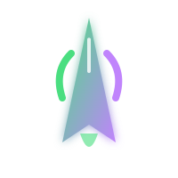

<div align="center">
  
  
  # ClawLaunch 🚀
  
  **The Elite Open-Source Command Center for LinkedIn & X Automation.**
  
  [](https://clawlaunch.web.app)
  [](LICENSE)
  [](https://nextjs.org)
  [](https://tailwindcss.com)
  
  ---
  
  ### 🌌 Automate Your Growth with a Cyber-Glass Aesthetic.
  *ClawLaunch is a stunning frontend interface designed for OpenClaw bot configuration, featuring a premium glassmorphism UI and butter-smooth animations.*
</div>

## ✨ Key Features

- 🎨 **Cyber-Glass UI**: A state-of-the-art Glassmorphism interface with deep void backgrounds.
- ⚡ **120Hz Fluidity**: Staggered animations and staggered reveals powered by Framer Motion.
- 🎭 **Interactive Bento Grid**: Beautiful, responsive card-based layout for intuitive configuration.
- 🌊 **Parallax Dynamics**: 3D floating elements that track your mouse movement for a living UI.
- 📱 **Adaptive Design**: Seamless experience across mobile, tablet, and desktop displays.
- 🎯 **Developer First**: Built with Next.js 14 App Router and TypeScript for ultimate reliability.

## 🛠️ Tech Stack

- **Framework**: Next.js 14 (App Router)
- **Styling**: Tailwind CSS
- **Motion**: Framer Motion
- **Icons**: Lucide React
- **Typography**: Inter & JetBrains Mono

## 🚀 Quick Start

1. **Clone the repository:**
   ```bash
   git clone https://github.com/Boss17536/clawlaunch.git
   ```
2. **Install dependencies:**
   ```bash
   npm install
   ```
3. **Ignite the development server:**
   ```bash
   npm run dev
   ```
4. **Open the cockpit:**
   Navigate to [http://localhost:3000](http://localhost:3000).

## 🎨 Design Philosophy

ClawLaunch follows a **Dark-Modern** aesthetic, focusing on:
- **Depth**: Multi-layered transparency and `backdrop-blur-xl`.
- **Glow**: Subtle accent borders using `Electric Green` (#4ade80) and `Cyber Purple` (#c084fc).
- **Precision**: Pixel-perfect spacing and 200ms easing functions.

## 📦 Project Overview

```text
ClawLaunch/
├── app/            # App Router (Pages & Styles)
├── components/     # High-Performance UI Components
└── ...             # Modern Tooling Config
```

## 📝 License

Distributed under the MIT License. See `LICENSE` for more information.

---
<div align="center">
  Built with 💚 and ⚡ for the OpenClaw Ecosystem.
</div>

